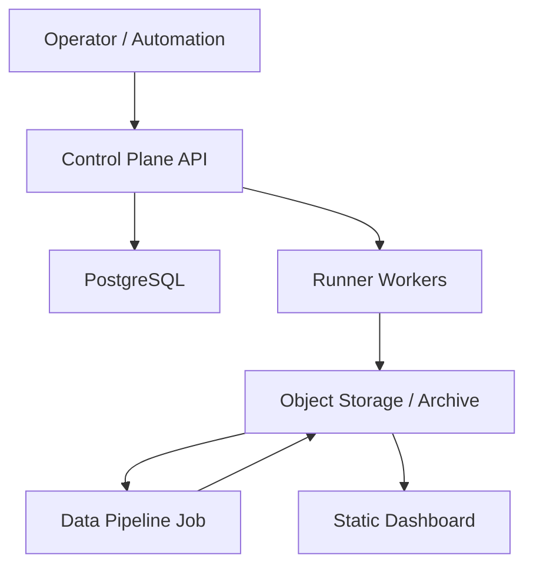

# Deployment Topology

## Local Development

Use Docker Compose or an equivalent local setup:

```text
postgres
minio
ttfhw-control-plane
ttfhw-runner
ttfhw-data-pipeline
ttfhw-dashboard
```

Local archive path:

```text
.ttfhw-dev/
  artifacts/
  archive/
```

## Minimal Production



## Control Plane

Deploy as a long-running service.

Recommended:

- container image
- environment-based settings
- PostgreSQL connection
- structured JSON logs
- OpenTelemetry exporter

## Runner

Deploy as one or more workers.

Runner pools can be separated by executor type:

```text
runner-local-docker
runner-remote-ssh
runner-kubernetes
```

Runner machines must be treated as untrusted-code execution hosts because they
compile and run arbitrary target repository code.

## Data Pipeline

Can run as:

- scheduled job
- event-triggered job after run completion
- manual CLI for migrations

The data pipeline should be idempotent: re-running it for the same immutable
input should produce the same output.

## Dashboard

Deploy independently as:

- GitHub Pages
- object-storage static website
- CDN-backed static site
- internal Nginx-hosted static site

The dashboard should not require direct access to the control-plane database.

## Storage Evolution

Stage 1:

- GitHub repository or local filesystem for reports
- generated static Dashboard

Stage 2:

- object storage for full artifacts
- Git repository only for small generated indexes if needed

Stage 3:

- object storage plus Parquet/DuckDB analytical datasets
- trend queries generated offline or served by a lightweight read API

## Network Boundaries

- Dashboard reads public or internal static data.
- Control plane APIs require authentication.
- Runner communicates with control plane using scoped credentials.
- Object storage write credentials should be scoped per runner or pipeline role.
