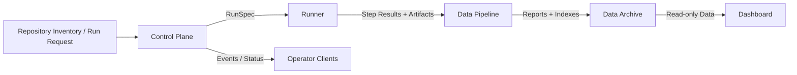

# Target Architecture

## Problem Statement

The original TTFHW prototype combined backend service code, verification runner
logic, report data, dashboard source, and static deployment output in one
repository. That was useful for fast iteration, but it makes the platform hard
to evolve:

- service code is coupled to local report files
- verification data is mixed with implementation
- generated dashboard output is committed next to source code
- queue state is stored as mutable YAML
- runner behavior and API state share one process boundary
- frontend data loading assumes a local repository layout

The target architecture separates these responsibilities into stable layers.

## Goals

- Keep service code independent from any specific verification repository.
- Make verification execution replaceable across local, remote, and future
  clustered environments.
- Store verification data as immutable run snapshots.
- Let the dashboard deploy independently from the backend service.
- Use explicit schemas between layers.
- Preserve a migration path from the current repository.

## Non-Goals

- Reusing the old repository layout as the future layout.
- Building a full multi-tenant SaaS platform immediately.
- Introducing distributed workflow infrastructure before basic contracts are
  stable.
- Making the dashboard responsible for triggering verification jobs.

## Layered System

## Runtime Flow

1. A user, script, or scheduled process submits a verification request.
2. The control plane validates the request and creates a durable job/run record.
3. The control plane emits an immutable `RunSpec`.
4. A runner receives or polls for the `RunSpec`.
5. The runner executes verification steps inside the selected executor.
6. The runner emits step results and artifact references.
7. The data pipeline validates, normalizes, indexes, and publishes the data.
8. The dashboard reads the published index and reports.

## Repository Split

| Layer | Repository | Primary Change Rate |
| --- | --- | --- |
| Architecture | `computing-infra/TTFHW` | Low |
| Control Plane | `computing-infra/ttfhw-control-plane` | Medium |
| Runner | `computing-infra/ttfhw-runner` | High |
| Data Pipeline | `computing-infra/ttfhw-data-pipeline` | Medium |
| Dashboard | `computing-infra/ttfhw-dashboard` | Medium |

The runner is intentionally separated from the control plane because execution
details are expected to change faster than API and state management.

## Source of Truth

| Concern | Source of Truth |
| --- | --- |
| Job/run state | Control-plane database |
| Run execution facts | Runner step outputs |
| Published report history | Data archive |
| Dashboard visualization | Dashboard source |
| Architecture and boundaries | This repository |

## Key Constraint

No implementation repository may assume the old monorepo filesystem layout as
the platform contract. Local directory layouts are development conveniences,
not cross-layer APIs.
